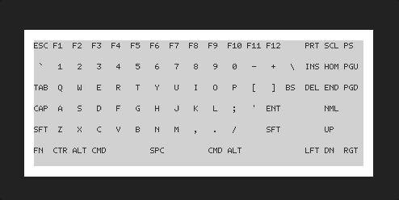

# kbdtest

<p align=center>

<p/>

`kbdtest` is a simple Python program that tests keyboard input
using an interactive, terminal-based, visual keyboard display.
It was originally developed for testing DIY keyboard PCBs prior to final
assembly.
Keyboard input is collected using `pynput` and the TUI uses
`ncurses`. This program was inspired by the utilities
[here](https://keyboardchecker.com/). Currently, this program
is only used  

# Usage

After installation, run the program using `kbdtest`.
Test keys individually or several at a time. `Shift-q` quits 
the program and returns to the terminal. If, for some reason, 
the program ends without the curses backend calling `endwin()`,
you can fix your terminal prompt by running `reset` in your terminal.

# Install

```
git clone https://github.com/Ruunyox/kbdtest
cd kbdtest
pip3 install .
```

---
# Requirements

1. numpy - used for layer arrays
2. ncurses - used for terminal drawing 
3. pynput - used for keyboard input monitoring


